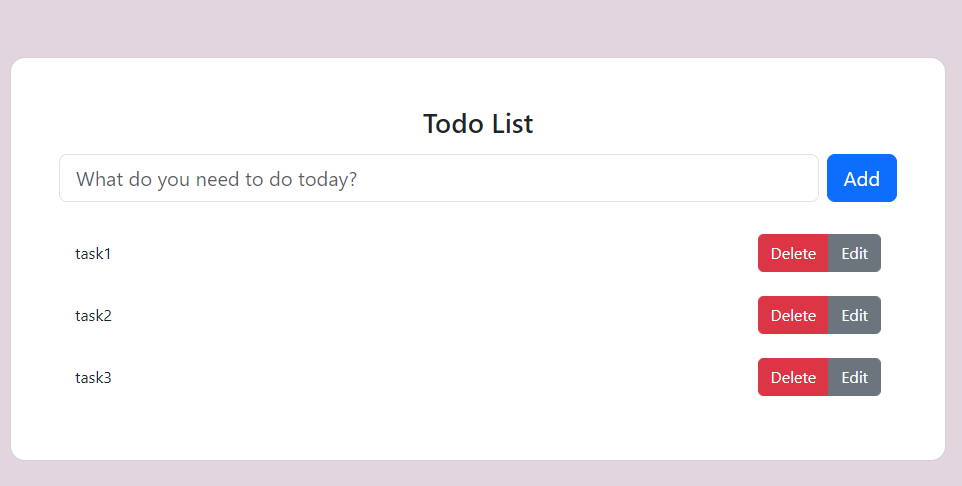

# Simple Todo List App



This is a simple to-do list web application built with React. It allows you to add, edit, and delete tasks.


## Features

- Add tasks to your to-do list.
- Edit existing tasks.
- Delete tasks.
- User-friendly interface.

## Usage

1. Clone the repository:

   ```bash
   git clone https://github.com/your-username/your-repo-name.git

2. Install project dependencies:
   ```bash
    npm install

3. Start the development server:
   ```bash
    npm start

4. Open your web browser and visit http://localhost:3000 to use the application.

