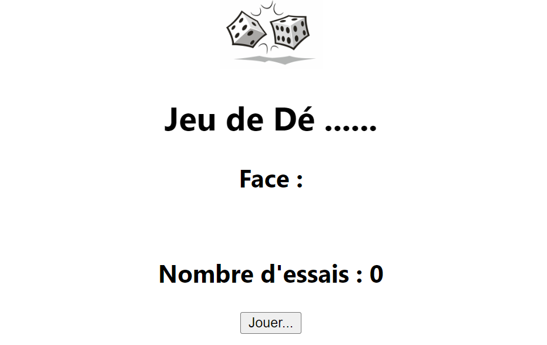

# JeuDe - A Simple Dice Game in React




## Overview

JeuDe is a simple web application built using React that simulates a dice game. The objective of the game is to guess and match the randomly rolled dice face to a target face. The game keeps track of the number of attempts and provides a reset option upon winning.

## Features


- Randomly rolls a dice face.
- Counts the number of attempts.
- Allows the user to reset the game upon winning.
- Provides visual feedback on the rolled dice face.


## Getting Started

To run this project locally on your machine, follow these steps:

1. Clone this repository to your local machine:
```bash
 git clone https://github.com/your-username/JeuDe.git
```
2. Navigate to the project directory:
 ```bash
 cd JeuDe
```
3.Install the required dependencies:
```bash
npm install
```
4. Run the app:
```bash
npm start
```

## How to Play

- Click the "Jouer..." button to roll the dice.
- Try to match the rolled dice face with the target face (configured to 4 by default).
- The game keeps track of the number of attempts.
- Upon winning, a "Bravo Vous Avez Gagné" message will be displayed, and you can reset the game by clicking the "Reset" button.
